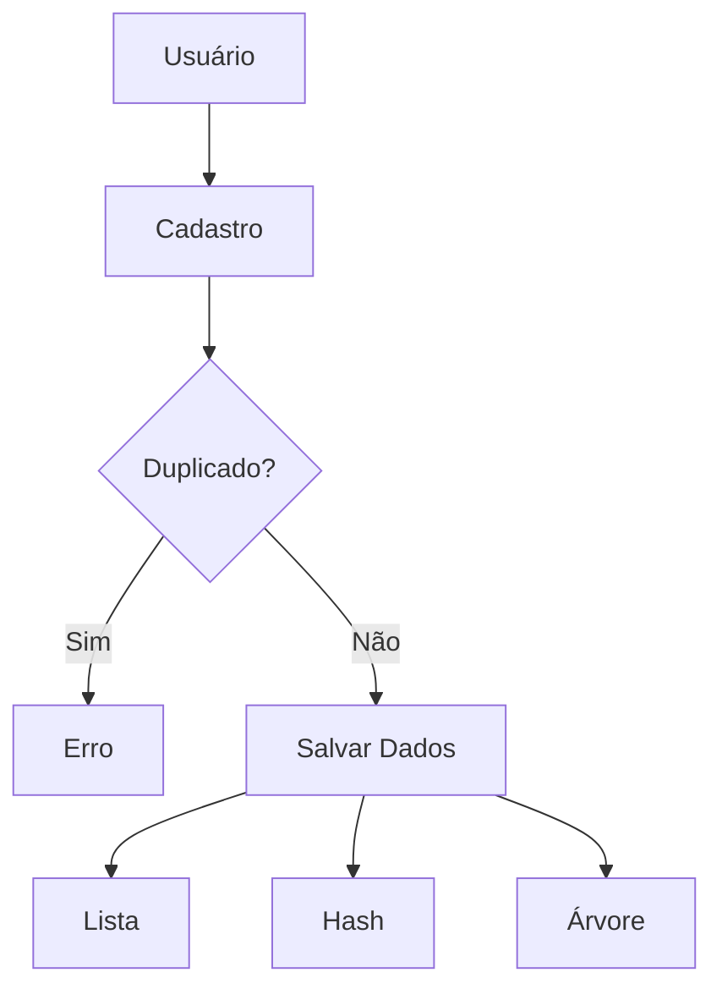

# 🚀 CRM com Programação Dinâmica

<p align="center">
  
  
  
  
</p>

---

## 📑 Sumário

* [📌 Descrição](#-descrição-do-projeto)
* [🎯 Objetivo](#-objetivo-acadêmico)
* [⚙️ Funcionalidades](#️-funcionalidades-do-sistema)
* [🧠 Estruturas de Dados](#-estruturas-de-dados-utilizadas)
* [🔁 Recursividade](#-recursividade)
* [🔍 Duplicidade](#-verificação-de-duplicidade)
* [⚡ Memoização](#-programação-dinâmica-e-memoização)
* [🔄 Fluxo do Sistema](#-fluxo-do-sistema)
* [🖥️ Interface](#️-interface-front-end)
* [🚀 Como Rodar](#-como-rodar-o-projeto)
* [🧪 Exemplos](#-exemplos-de-uso)
* [🏁 Conclusão](#-conclusão)

---

## 📌 Descrição do Projeto

Sistema de CRM (Customer Relationship Management) desenvolvido em Python com Flask.

O projeto demonstra, de forma prática, o uso de técnicas avançadas como:

* 🔁 Recursividade
* ⚡ Programação Dinâmica
* 🧠 Memoização
* 🧱 Estruturas de Dados

---

## 🎯 Objetivo Acadêmico

Aplicar conceitos de algoritmos e otimização para resolver problemas reais, evitando recomputações e melhorando a eficiência do sistema.

---

## ⚙️ Funcionalidades do Sistema

### ➕ Cadastro de Lead

* Nome
* Telefone
* Email
* CPF

✔ Validação automática de duplicidade

---

### 🔍 Busca de Lead

Busca por CPF utilizando **Hash (dicionário)**

✔ Complexidade O(1)

---

### 📅 Agendamento Inteligente

Recebe intervalos e retorna o máximo de agendamentos possíveis sem conflito.

✔ Otimizado com programação dinâmica

---

## 🧠 Estruturas de Dados Utilizadas

| Estrutura      | Uso           | Vantagem             |
| -------------- | ------------- | -------------------- |
| Lista          | Armazenamento | Simples e sequencial |
| Hash           | Busca por CPF | Muito rápida (O(1))  |
| Árvore Binária | Organização   | Estrutura ordenada   |

---

## 🔁 Recursividade

📁 `servicos/verificador_duplicidade.py`

A função percorre a lista chamando a si mesma.

### 🔄 Fluxo:

1. Compara lead atual
2. Se não for duplicado → chama próximo índice
3. Repete até o final

✔ Elimina loops tradicionais

---

## 🔍 Verificação de Duplicidade

Evita registros repetidos com base em:

* CPF
* Email
* Telefone

✔ Garante integridade dos dados

---

## ⚡ Programação Dinâmica e Memoização

📁 `servicos/agendador.py`

### 🧠 Ideia

Dividir o problema em subproblemas menores e armazenar resultados.

### 🔄 Funcionamento:

* Cada índice representa um subproblema
* Resultados são armazenados em `memo`
* Evita recomputação

### 🚀 Benefício:

| Sem Memoização | Com Memoização |
| -------------- | -------------- |
| Exponencial    | Linear         |

---

## 🔄 Fluxo do Sistema



---

## 🖥️ Interface (Front-end)

* HTML + Tailwind
* Integração com API Flask
* Atualização em tempo real

---

## 🚀 Como Rodar o Projeto

### 1️⃣ Instalar dependências

```bash
pip install flask
```

---

### 2️⃣ Estrutura do projeto

```bash
crm_programacao_dinamica/
│
├── app.py
├── templates/
│   └── index.html
├── modelos/
├── servicos/
├── dados/
```

---

### 3️⃣ Executar

```bash
python app.py
```

---

### 4️⃣ Acessar

👉 [http://127.0.0.1:5000/](http://127.0.0.1:5000/)

---

## 🧪 Exemplos de Uso

### 📌 Cadastro

```json
{
  "nome": "João",
  "telefone": "1199999",
  "email": "joao@email.com",
  "cpf": "123"
}
```

---

### 📌 Agendamento

```json
{
  "intervalos": [[1,3],[2,5],[4,7]]
}
```

---

## 🏁 Conclusão

Projeto demonstra aplicação prática de:

* Estruturas de dados
* Recursividade
* Programação dinâmica

✔ Solução eficiente
✔ Código organizado
✔ Fácil expansão

---

## 👨‍💻 Autor

**Kauã Rodrigues de Souza - RM 559335**
**Leonardo Luiz Jardim Queijo - RM 559842**
**Felipe Santos Marceli - RM 560456**
**Enzo Galhardo - RM561001**
**Kauan Diogo - RM560727**
**Lucas Villar - RM560005**

---

## ⭐ Sugestão

Se este projeto te ajudou, considere dar uma estrela ⭐ no repositório.
