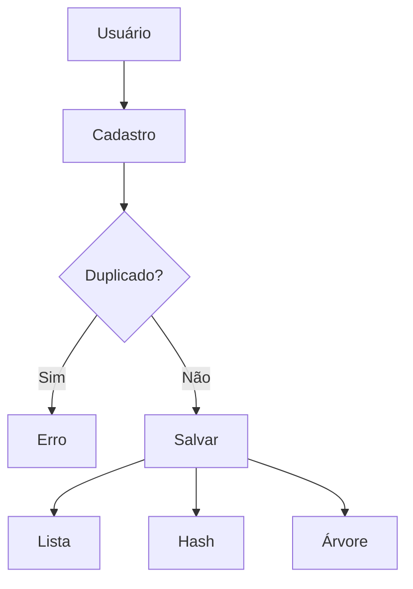
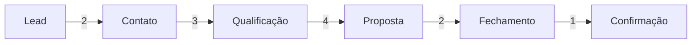

# 🚀 HSR One — CRM com Programação Dinâmica e Grafos

<p align="center">
  
  
  
  
</p>

---

## 📑 Sumário

* [📌 Descrição](#-descrição-do-projeto)
* [🎯 Objetivo](#-objetivo-acadêmico)
* [⚙️ Funcionalidades](#️-funcionalidades-do-sistema)
* [🧠 Estruturas de Dados](#-estruturas-de-dados-utilizadas)
* [🔁 Recursividade](#-recursividade)
* [🔍 Duplicidade](#-verificação-de-duplicidade)
* [⚡ Memoização](#-programação-dinâmica-e-memoização)
* [📅 Agendamento](#-agendamento-inteligente)
* [🧭 Grafos e Dijkstra](#-grafos-e-dijkstra)
* [🔄 Fluxo do Sistema](#-fluxo-do-sistema)
* [🖥️ Interface](#️-interface-front-end)
* [🚀 Como Rodar](#-como-rodar-o-projeto)
* [🧪 Exemplos](#-exemplos-de-uso)
* [🏁 Conclusão](#-conclusão)

---

## 📌 Descrição do Projeto

Sistema de CRM (Customer Relationship Management) desenvolvido em Python com Flask.

O projeto demonstra, de forma prática, o uso de:

* 🔁 Recursividade
* ⚡ Programação Dinâmica
* 🧠 Memoização
* 🧱 Estruturas de Dados
* 🧭 Grafos
* 📊 Algoritmo de Dijkstra

---

## 🎯 Objetivo Acadêmico

Aplicar conceitos avançados de algoritmos para:

* Evitar recomputações
* Otimizar processos
* Modelar fluxos reais como grafos
* Encontrar soluções eficientes automaticamente

---

## ⚙️ Funcionalidades do Sistema

### ➕ Cadastro de Lead

* Nome
* Telefone
* Email
* CPF

✔ Validação automática de duplicidade (recursiva)

---

### 🔍 Busca de Lead

Busca por CPF utilizando **Hash (dicionário)**

✔ Complexidade O(1)

---

### 📅 Agendamento Inteligente

Recebe intervalos e retorna o máximo de atendimentos possíveis sem conflito.

✔ Utiliza programação dinâmica

---

### 📍 Melhor Caminho no CRM

Calcula o fluxo mais eficiente usando **Dijkstra**

✔ Mostra:

* Caminho completo
* Custo por etapa
* Custo total
* Visualização no front

---

## 🧠 Estruturas de Dados Utilizadas

| Estrutura | Uso           | Vantagem            |
| --------- | ------------- | ------------------- |
| Lista     | Armazenamento | Simples             |
| Hash      | Busca por CPF | O(1) (muito rápido) |
| Árvore    | Organização   | Ordenação           |
| Grafo     | Fluxo CRM     | Modelagem real      |

---

## 🔁 Recursividade

📁 `servicos/verificador_duplicidade.py`

A verificação percorre a lista de leads chamando a si mesma.

### 🔄 Funcionamento:

1. Compara o lead atual
2. Se não for duplicado → chama próximo
3. Continua até o final

✔ Substitui loops tradicionais
✔ Código mais elegante

---

## 🔍 Verificação de Duplicidade

Evita registros repetidos com base em:

* CPF
* Email
* Telefone

✔ Mantém integridade dos dados

---

## ⚡ Programação Dinâmica e Memoização

📁 `servicos/agendador.py`

### 🧠 Ideia

Dividir o problema em partes menores e salvar resultados já calculados.

### 🔄 Funcionamento:

* Cada posição vira um subproblema
* Resultados são guardados em memória
* Evita recalcular

### 🚀 Benefício:

| Sem Memoização | Com Memoização |
| -------------- | -------------- |
| Exponencial    | Linear         |

---

## 📅 Agendamento Inteligente

Resolve o problema de intervalos:

✔ Entrada:

```json
[[1,3],[2,5],[4,7]]
```

✔ Saída:

* Máximo de atendimentos sem conflito

✔ Estratégia:

* Ordenação
* Escolha ótima
* Reutilização de resultados

---

## 🧭 Grafos e Dijkstra

📁 `servicos/dijkstra.py`

O fluxo do CRM foi modelado como um grafo:

```text
Lead → Contato → Qualificação → Proposta → Fechamento → Confirmação
```

Cada conexão possui um custo.

---

### 🧮 Algoritmo utilizado

Dijkstra — encontra o caminho de menor custo.

---

### 📊 Resultado

✔ Caminho mínimo:

```text
Lead → Contato → Qualificação → Proposta → Fechamento → Confirmação
```

✔ Custos por etapa:

| De           | Para         | Custo |
| ------------ | ------------ | ----- |
| Lead         | Contato      | 2     |
| Contato      | Qualificação | 3     |
| Qualificação | Proposta     | 4     |
| Proposta     | Fechamento   | 2     |
| Fechamento   | Confirmação  | 1     |

✔ Custo total:

```text
12
```

---

### ⚡ Por que esse caminho é o melhor?

* Minimiza custo total
* Evita caminhos mais caros
* Garante eficiência no processo

---

## 🔄 Fluxo do Sistema

### 📌 Cadastro



---

### 📌 Fluxo CRM (Dijkstra)



---

## 🖥️ Interface (Front-end)

* HTML + TailwindCSS
* Integração com Flask
* Exibição visual do fluxo
* Animações nas etapas
* Custo por etapa exibido

---

## 🚀 Como Rodar o Projeto

### 1️⃣ Instalar dependências

```bash
pip install flask
```

---

### 2️⃣ Estrutura do projeto

```bash
hsr_one/
│
├── app.py
├── templates/
│   └── index.html
├── modelos/
├── servicos/
├── dados/
```

---

### 3️⃣ Executar

```bash
python app.py
```

---

### 4️⃣ Acessar

👉 [http://127.0.0.1:5000/](http://127.0.0.1:5000/)

---

## 🧪 Exemplos de Uso

### 📌 Cadastro

```json
{
  "nome": "João",
  "telefone": "1199999",
  "email": "joao@email.com",
  "cpf": "12345678901"
}
```

---

### 📌 Agendamento

```json
{
  "intervalos": [[1,3],[2,5],[4,7]]
}
```

---

### 📌 Melhor Caminho

```json
{
  "detalhes": [
    {"de": "Lead", "para": "Contato", "custo": 2}
  ],
  "custo_total": 12
}
```

---

## 🏁 Conclusão

O projeto demonstra aplicação prática de conceitos fundamentais:

* Estruturas de dados
* Recursividade
* Programação dinâmica
* Grafos e Dijkstra

✔ Sistema otimizado
✔ Código organizado
✔ Visual moderno
✔ Aplicação realista

---

## 👨‍💻 Autor

**Felipe Marceli**

---

## ⭐ Sugestão

Se este projeto te ajudou, considere dar uma estrela ⭐ no repositório.

---

